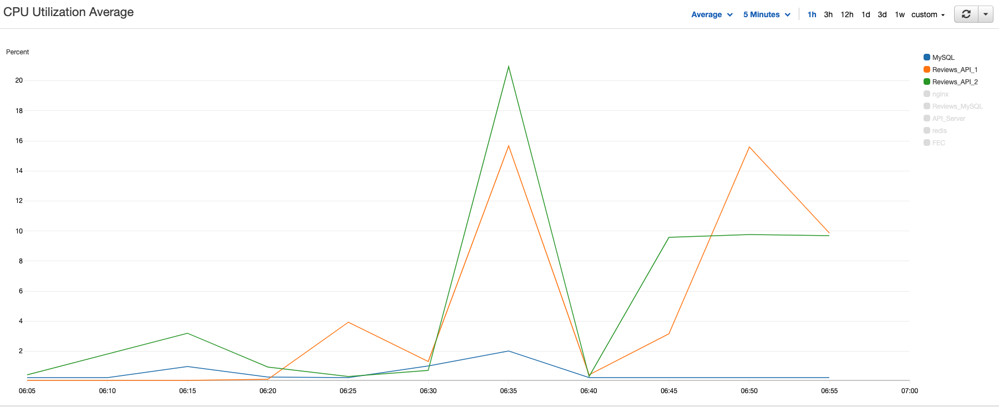

## Reviews API

 

### About
Reviews API is the back end infrastructure for the front end application of an e-commerce website, *Fashion House* with primary focus on system design and scaling.

### Tech Stack
* Reviews Microservice was primarily built using Node/Express with MySQL for database.
* NGINX load balancer
* Amazon Web Services for Deployment
* k6, loader.io integrated with New Relic
* docker

### Schema

### Project Overview
* Design, analyze multiple DBMS options using MongoDB and MySQL and choose one
* Extract, Transform and Load application data into MySQL
    * 1 MM Product Ids
    * 5 MM Review Ids
    * 2 MM Photos
    * 20 MM Characteristics Meta Data
* Design and Implement Service Logic
* Optimize the system by analyzing query times and server responses
* Deploy Client + API hub + Reviews API to AWS
* Stress test the system in dev, prod
* Measure, improve the performance of the system at scale
* Scale the app's architecture to support loads up to 1000 RPS

### Main Goals
1. To achieve response time (latency) of < 2000 ms under load
2. To achieve throughput of 1000 RPS on EC2
3. To get error rate < 1% under load

### Deployment

After achieving my sub goal of query time of less than 50 ms in the local environment, I decided to deploy my microservice and MySQL database onto the cloud using AWS EC2 instance.

### Observations and Bottlenecks
Using loader.io integrated with new relic testing platform, I observed that my response time was was pretty high (~3 seconds) for 500 RPS. And AWS cloudwatch report showed that my CPU utilization of MySQL+Reviews EC2 instance was around 30%,

 
 

### Optimizations
#### Horizontal Scaling

In order to decrease response time, I ended up horizontally scaling my system using nginx load balancing with least-conn strategy. I also deploted server and database separately. This decreased my response time from ~3000 ms to 5 ms and error rate decreased from

1000 RPS, Response Time of *5 ms* with *0.0%* Error rate

 
 
k6 Test in development environment (my local machine)
 

